# 🛡️ ASGARD INTELLIGENCE (GNN-AIOps)
## Gigafactory Real-Time Anomaly Prediction & Digital Twin

ASGARD INTELLIGENCE, modern bir akıllı üretim tesisindeki (Gigafactory) operasyonel riskleri, departmanlar arası ağ ilişkilerini ve telemetri verilerini analiz ederek proaktif bir şekilde anomali tespiti yapan gelişmiş bir **GNN-AIOps** platformudur.

Sistem, geleneksel tek boyutlu eşik kontrollerinin aksine, fabrika departmanlarını birbirine bağlı düğümler (nodes) olarak ele alan ve aralarındaki etkileşimleri öğrenen **Graph Attention Network (GAT)** yapay zeka modelini kullanır. Bu sayede, tekil olarak normal görünen fakat etkileşimli olarak arıza işareti veren anomaliler milisaniyeler düzeyinde tahmin edilir.

---

## 🗺️ Sistem Mimarisi

ASGARD INTELLIGENCE backend ve frontend servisleri, yüksek performanslı ve güvenli bir veri boru hattı (data pipeline) ile entegre edilmiştir.

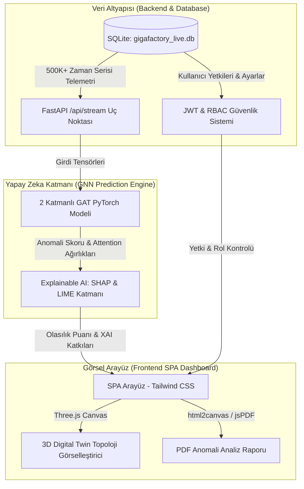

---

## 🛠️ Kullanılan Teknolojiler

### Backend & Yapay Zeka
*   **Web Framework:** [FastAPI](https://fastapi.tiangolo.com/) (Yüksek hızlı, asenkron Python web API)
*   **Derin Öğrenme Kütüphaneleri:** [PyTorch](https://pytorch.org/) ve [PyTorch Geometric](https://pytorch-geometric.readthedocs.io/)
*   **Model Mimarisi:** GATAnomalyModel (2 katmanlı, 4 dikkat kafalı - Multi-head Graph Attention Network)
*   **Veritabanı:** SQLite3 (`gigafactory_live.db` - 500,000+ satırlık gerçek zamanlı telemetri kaydı)
*   **Güvenlik:** JWT (JSON Web Token - `PyJWT`) tabanlı Rol Bazlı Erişim Kontrolü (RBAC)
*   **Açıklanabilir Yapay Zeka (XAI):** SHAP ve LIME öznitelik analizi

### Frontend & UX
*   **Temel Yapı:** Modern Vanilla HTML5 ve JavaScript ES6
*   **Tasarım & Styling:** Tailwind CSS (Modern karanlık tema ve glassmorphic kartlar)
*   **3D Görselleştirme:** [Three.js](https://threejs.org/) (WebGL tabanlı parçacık sistemleri ve animasyonlar)
*   **Grafikler:** [Chart.js](https://www.chartjs.org/) (Gerçek zamanlı veri akış grafikleri)
*   **Raporlama:** html2canvas ve jsPDF (Dinamik rapor oluşturma ve indirme)

---

## 🚀 Kurulum ve Çalıştırma Kılavuzu

### Gereksinimler
Sistemi çalıştırabilmek için bilgisayarınızda **Python 3.10+** kurulu olmalıdır.

### 1. Depoyu Klonlayın veya İlgili Klasöre Geçin
```bash
cd newAnomali
```

### 2. Gerekli Kütüphaneleri Yükleyin
Gerekli Python paketlerini kurmak için aşağıdaki komutu çalıştırın:
```bash
pip install fastapi uvicorn PyJWT numpy torch torch-geometric pandas matplotlib
```
> [!NOTE]
> PyTorch Geometric yüklemesinde sorun yaşarsanız, kendi işletim sisteminize ve CUDA sürümünüze uygun tekerlek (wheel) paketlerini [PyG Kurulum Sayfasından](https://pytorch-geometric.readthedocs.io/en/latest/install/installation.html) edinebilirsiniz.

### 3. Backend Sunucusunu Başlatın
Uygulama, backend sunucusu üzerinden statik HTML dosyalarını da sunacak şekilde yapılandırılmıştır. Sunucuyu çalıştırmak için:
```bash
python backend/backend/main.py
```
Sunucu başarıyla başlatıldığında tarayıcınızdan **`http://127.0.0.1:5003`** adresine giderek uygulamaya erişebilirsiniz.

---

## 🗄️ Veritabanı ve Veri Boru Hattı

Sistem, `gigafactory_live.db` veritabanında yer alan `live_telemetry` tablosundan beslenir. SQLite veritabanı, saniyede binlerce telemetri verisini okuyabilecek indeksleme yapısına sahiptir.
Telemetri akışı, 4 ana departmanı (düğümü) temsil eden **16 öznitelikten** oluşur:
1.  **IT/Network Düğümü (Node 0):** `net_lat` (Latency), `net_thr` (Throughput), `net_p_loss` (Packet Loss), `net_sec` (Security State)
2.  **IoT Düğümü (Node 1):** `iot_vib` (Vibration), `iot_temp` (Temperature), `iot_torq` (Torque), `iot_cycle` (Machine Cycle)
3.  **Finans Düğümü (Node 2):** `fin_cost` (Transaction Cost), `fin_fraud` (Fraud Flag), `fin_risk` (Risk Score), `fin_inv` (Inventory Value)
4.  **Lojistik Düğümü (Node 3):** `log_path` (Path Efficiency), `log_coll` (Collision Warning), `log_soc` (State of Charge), `log_task` (Task rate)

Her saniye API (`/api/stream`), veritabanından sıradaki telemetri satırını okur, veriyi **PyTorch Geometric Data** nesnesine dönüştürür ve GAT modelinden geçirerek anomali tahmin puanını belirler.

---

## 🖥️ Sayfa Bazlı Detaylı Açıklamalar ve Ekran Görüntüleri

Aşağıda, uygulamada yer alan her bir sayfanın arayüz tasarımı, işlevleri ve ekran görüntüleri detaylandırılmıştır.

---

### 1. Kimlik Doğrulama Ekranı (Login Page)

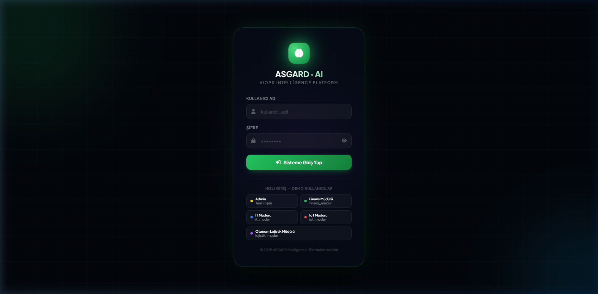

#### **Detaylı Açıklama:**
*   **Dosya:** [login.html](frontend/login.html)
*   **İşlev:** Sisteme güvenli giriş kapısıdır. Kullanıcılardan alınan bilgiler FastAPI `/api/login` uç noktasına gönderilir. Başarılı girişte backend, kullanıcı izinlerini (pages), adını, departmanını ve rolünü içeren bir **JWT token** döndürür ve bu token tarayıcıda `localStorage` üzerinde saklanır.
*   **Tasarım Özellikleri:** Modern glassmorphic giriş formu, neon yeşili gölgelendirmeler, hareketli arka plan parçacıkları ve hata durumlarında kullanıcıyı bilgilendiren dinamik uyarı kartları içerir.
*   **Giriş Bilgileri (Admin):**
    *   **Kullanıcı Adı:** `admin`
    *   **Şifre:** `Admin@2025`

---

### 2. 3D Dijital İkiz Paneli (Dashboard)

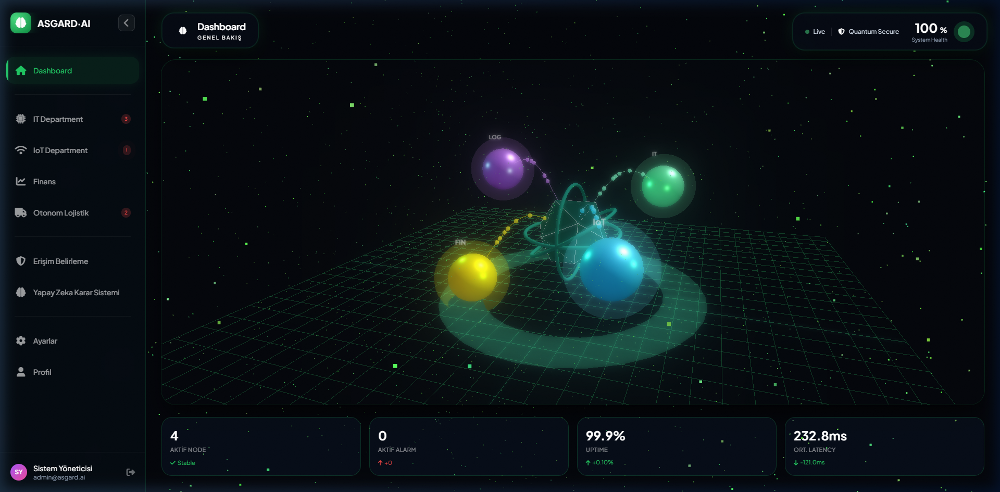

#### **Detaylı Açıklama:**
*   **Dosya:** [dashboard.html](frontend/dashboard.html)
*   **İşlev:** Fabrika düğümleri arasındaki ağ topolojisini **Three.js** kullanarak 3 boyutlu bir dijital ikiz simülasyonu olarak yansıtır. Modelden gelen anomali skoruna göre merkezi sistem durumu yeşilden (kararlı) kırmızıya (kritik) döner.
*   **Arayüz Metrikleri:**
    *   **Aktif Düğüm Sayısı:** Topolojideki canlı izlenen departman sayısı (4).
    *   **Aktif Alarm:** Sistem genelinde tespit edilen veya simüle edilen güncel arıza durumu.
    *   **Uptime ve Ortalama Gecikme:** Altyapının genel çalışma ve hız durumu.
*   **Tasarım Özellikleri:** Tam ekran WebGL parçacık arka planı, 3D etkileşimli küreler ve veri akışını gösteren dinamik halkalar (`pulse-ring`, `orbital-ring`).

---

### 3. Bilgi Teknolojileri Departmanı (IT Department)

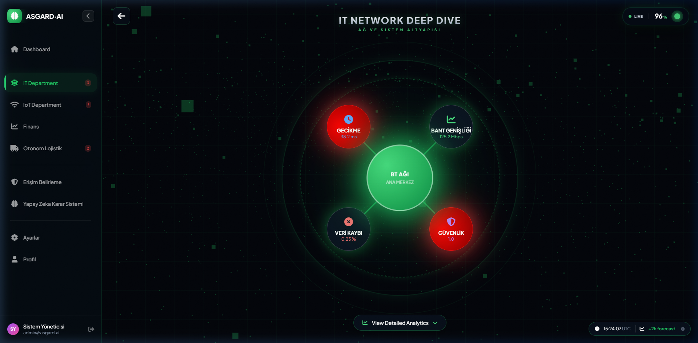

#### **Detaylı Açıklama:**
*   **Dosya:** [it.html](frontend/it.html)
*   **İşlev:** Fabrika veri merkezlerinin ve network altyapısının canlı analitiğini sunar. Sunucu durumları, ağ performansı, gecikme (latency) süreleri ve güvenlik metrikleri izlenir.
*   **Görselleştirmeler:** Chart.js grafikleri yardımıyla CPU kullanımı, RAM tüketimi, anlık bant genişliği (bandwidth) ve veri akış yönelimleri canlı olarak çizdirilir. Alt kısımda yer alan topoloji grafiği, IT düğümünün diğer departmanlarla olan ağ etkileşimini gösterir.
*   **Metrikler:** Depolama (128 GB), Ortalama CPU (3.2 GHz), RAM Kullanımı (32 GB) ve Bant Genişliği (10 Gbps) gibi donanımsal izleme alanları.

---

### 4. Endüstriyel IoT Departmanı (IoT Department)

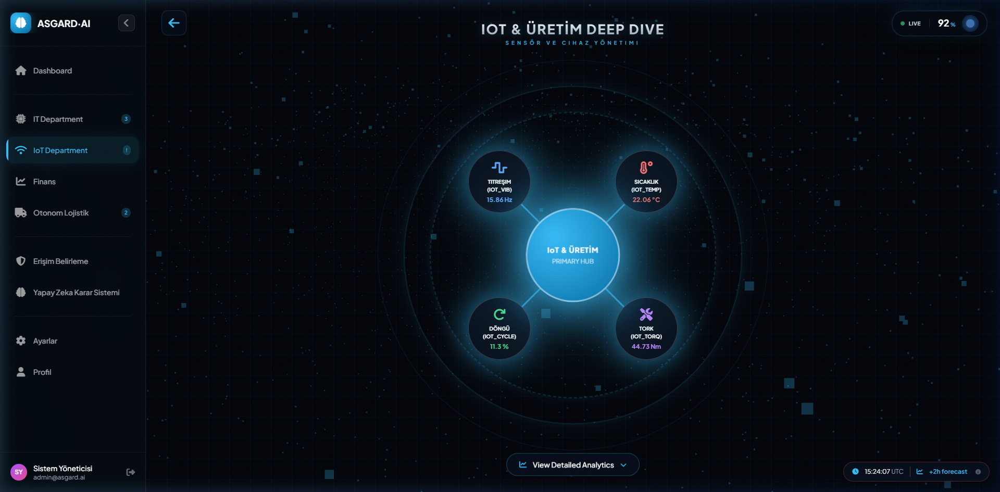

#### **Detaylı Açıklama:**
*   **Dosya:** [iot.html](frontend/iot.html)
*   **İşlev:** Üretim hattındaki IoT sensörlerinin (sıcaklık, titreşim, tork ve çalışma döngüsü) verilerini anlık analiz eder.
*   **İş Akışı:** Sensörlerden gelen verilerde ani yükselmeler veya paket kayıpları (`packet loss`) yaşandığında GNN tahmin motoru bunu anomali olarak yakalar ve operatöre kırmızı uyarı kartlarıyla bildirir.
*   **Metrikler:** Sıcaklık (68°C), Aktif Cihaz Sayısı (1,247), Packet Loss (%12.4) ve Güç Durumu (%87) gibi sensör odaklı veriler yer alır.

---

### 5. Finans ERP Paneli (Finance Analytics)

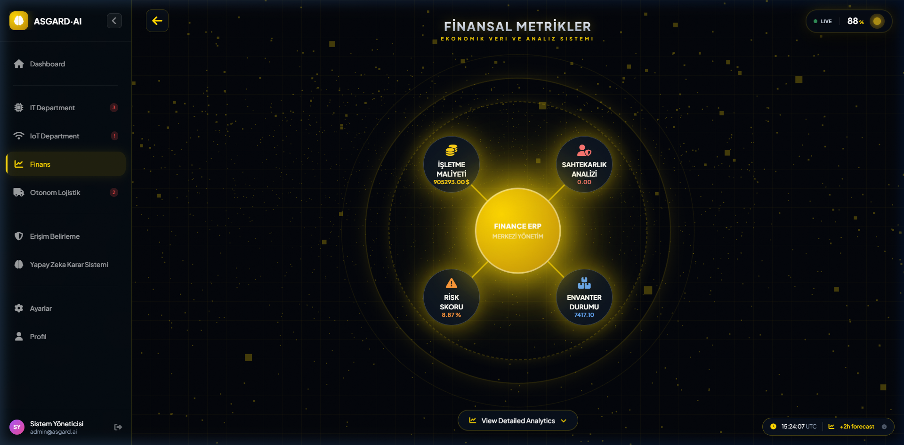

#### **Detaylı Açıklama:**
*   **Dosya:** [finance.html](frontend/finance.html)
*   **İşlev:** Fabrika içi mali işlemleri, fatura döngülerini, maliyet dalgalanmalarını ve fraud (sahtekarlık) risklerini inceler.
*   **Analiz:** Yapay zeka modeli finansal hareketlerdeki ani tutar sapmalarını veya olağandışı işlem sıklıklarını analiz ederek risk skorunu günceller.
*   **Arayüz Öğeleri:** Toplam işlem hacmi (1.2M Transaction), Hata Oranları (%3.2), Ortalama Sepet Tutarı ($245) ve Mali Döngü Süresi (4.2ms) grafikleri.

---

### 6. Otonom Lojistik Departmanı (Autonomous Logistics)

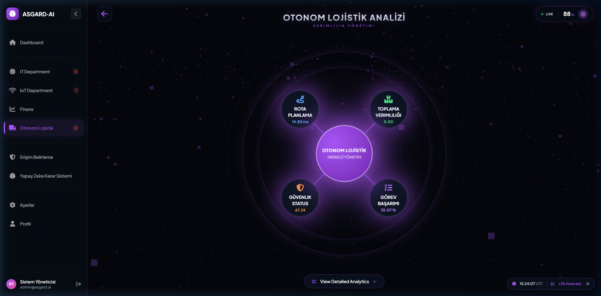

#### **Detaylı Açıklama:**
*   **Dosya:** [logistics.html](frontend/logistics.html)
*   **İşlev:** Fabrika içi otonom taşıma araçlarının (AGV/AMR), teslimat rotalarının ve lojistik görevlerin durumunu takip eder.
*   **Öznitelikler:** Çarpışma riski (`collision warning`), araç şarj seviyeleri (`state of charge - SoC`), rota verimliliği ve görev tamamlanma süreleri canlı olarak izlenir.
*   **Görsel Unsurlar:** Rota haritaları, pil durum grafikleri ve araçların görev dağılımını gösteren ilerleme çubukları.

---

### 7. Erişim Yetki Yönetimi (Access Control Panel)

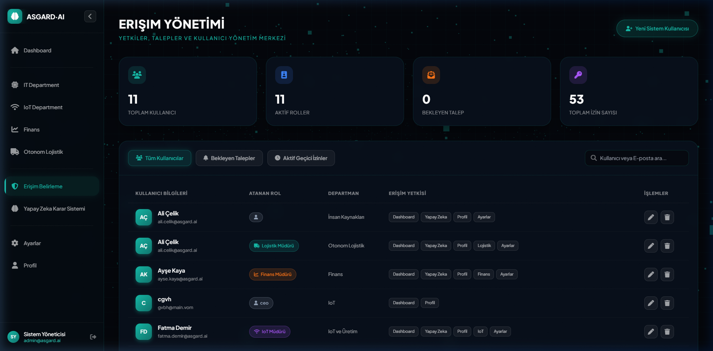

#### **Detaylı Açıklama:**
*   **Dosya:** [access.html](frontend/access.html)
*   **İşlev:** Rol Bazlı Erişim Kontrolü (RBAC) yönetim merkezidir. Yalnızca `admin` rolündeki kullanıcıların erişimine açıktır.
*   **Yönetim Araçları:**
    *   **Yeni Kullanıcı Ekleme:** İsim, e-posta, departman, rol ve erişebileceği sayfaların seçilerek sisteme eklenmesi.
    *   **Acil Erişim Talepleri:** Operatörlerin yetkileri dışındaki sayfalara girmek için oluşturdukları geçici erişim taleplerini onaylama veya reddetme ekranı.
*   **Güvenlik Günlüğü:** Tüm yetkilendirme kararları backend tarafında `access_requests.log` dosyasına kaydedilerek denetim (audit) geçmişi oluşturulur.

---

### 8. Yapay Zeka Karar Destek Sistemi (AI Decision Engine)

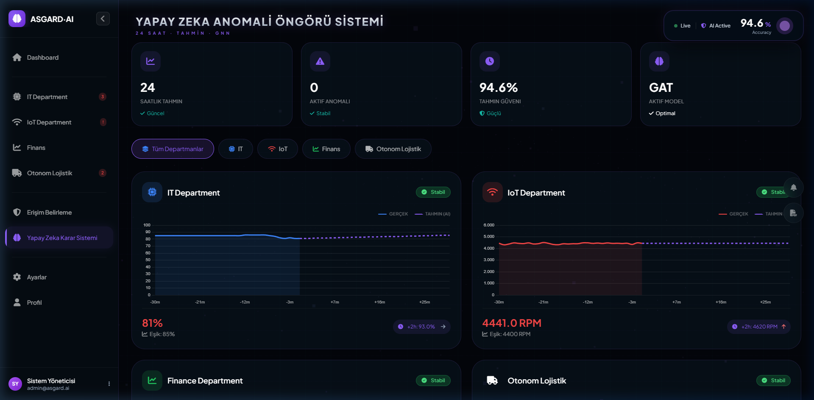

#### **Detaylı Açıklama:**
*   **Dosya:** [ai.html](frontend/ai.html)
*   **İşlev:** Graph Attention Network modelinin kararlarını şeffaflaştıran **Açıklanabilir Yapay Zeka (XAI)** ekranıdır.
*   **Detaylar:**
    *   **Model Doğruluğu & Ağırlıklar:** GAT modelinin doğruluk skoru (%94) ve dikkat kafalarının (attention heads) departmanlar arası bağ gücü.
    *   **SHAP & LIME Katkıları:** Hangi özniteliğin (örneğin IoT Sıcaklığı veya IT Paket Kaybı) anomali skorunun yükselmesinde ne kadar katkı sağladığını gösteren renkli etki barları.
*   **PDF Rapor Üretimi:** "PDF Rapor İndir" butonu sayesinde, o anki anomali tahminleri ve XAI grafikleri tek tıklamayla resmi bir analiz raporuna dönüştürülüp bilgisayara indirilebilir.

---

### 9. Sistem Ayarları (Settings Panel)

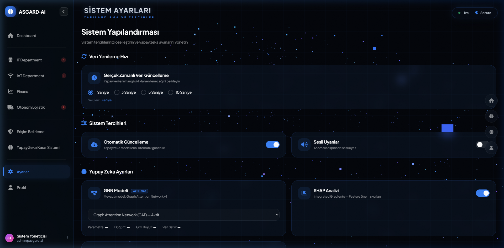

#### **Detaylı Açıklama:**
*   **Dosya:** [settings.html](frontend/settings.html)
*   **İşlev:** Platformun çalışma dinamiklerini özelleştiren konfigürasyon panelidir.
*   **Ayarlanabilir Alanlar:**
    *   **Veri Yenileme Hızı:** API'den veri çekme sıklığı (1s, 2s, 5s vb.). Değişim anında `localStorage` üzerinden tetiklenerek canlı akış hızını anında günceller.
    *   **Bildirimler & Sesli Uyarılar:** Kritik anomali durumlarında tarayıcı bildirimi ve sesli alarm verilip verilmeyeceği seçeneği.
    *   **Algoritma Seçimleri:** SHAP ve LIME analizlerinin aktif/pasif hale getirilmesi.
    *   **Veri Saklama Süresi:** Geçmiş telemetri kayıtlarının veritabanında tutulma süresi.

---

### 10. Kullanıcı Profili (Profile & Activity)

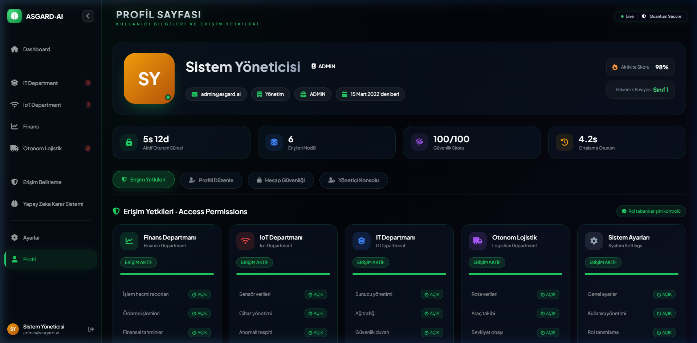

#### **Detaylı Açıklama:**
*   **Dosya:** [profile.html](frontend/profile.html)
*   **İşlev:** Giriş yapan kullanıcının kişisel bilgilerini, yetkili olduğu sayfaları ve geçmiş acil erişim taleplerini gösterir.
*   **Profil Güncelleme:** Kullanıcı adını, e-postasını ve baş harflerini değiştirebilir; şifresini güncelleyebilir.
*   **Profil Resmi Yükleme:** Kullanıcılar yerel bilgisayarlarından bir görsel yükleyerek profil resmi yapabilirler. Görsel, base64 formatına çevrilip tarayıcıda saklanır ve tüm sayfalardaki sidebar alanına yansıtılır.
*   **Geçici Yetki Geçmişi:** Kullanıcının daha önce talep ettiği acil sayfa izinleri ve bunların onay durumları bu ekranda listelenir.

---

## 🎬 Sunum ve Simülasyon (Demo) Modu

ASGARD INTELLIGENCE, projeyi jüriye veya yöneticilere sunarken kolaylık sağlaması amacıyla özel bir **Sunum Modu** barındırır.

*   **Sunum Modu Aktivasyonu:** Sistemde sunum modunu başlatmak için `/api/demo/presentation-start` API uç noktası tetiklenir (veya Yapay Zeka sayfasındaki buton kullanılır).
*   **Senaryo:** Sunum modu aktif edildiğinde sistem **10 dakika boyunca** yapay bir anomali durumuna geçer.
    *   IT departmanında **yüksek paket kaybı** (`net_p_loss > 12%`) ve **yüksek gecikme** (`net_lat > 85ms`),
    *   IoT departmanında **aşırı titreşim** (`iot_vib > 0.88`) ve **yüksek sıcaklık** (`iot_temp > 92°C`) enjekte edilir.
    *   AI Karar Sisteminde model anomali skoru **%94.2** olarak sabitlenir ve topolojide anomali yayılım halkaları kırmızı renkte parlamaya başlar.
*   **Durdurma:** Sunum sonlandığında `/api/demo/presentation-stop` ile sistem tekrar gerçek zamanlı SQLite telemetri verilerine döner.

---

## 👥 Proje Ekibi ve Görev Dağılımı

Detaylı ekip üyeleri ve üstlendikleri somut kod sorumlulukları [GRUP_UYELERI_VE_GENEL_ROLLER.md](docs/GRUP_UYELERI_VE_GENEL_ROLLER.md) belgesinde tanımlanmıştır:

*   **Ahmet İşleyen (AI & API Mimarı):** Graph Attention Network (GAT) modeli eğitimi (`backend/main.py`), olasılık çıkarım boru hattı, XAI (SHAP & LIME) matematiksel altyapısı ve Sunum Modu senaryolarının kodlanması.
*   **Mehmet Ersolak (Backend & Veri Mühendisi):** SQLite veri tabanı mimarisi, ROWID indeksleme optimizasyonları, veri tutarlılık analizi (`analyze_db.py`), JWT & RBAC yetkilendirme katmanı ve acil erişim onay mekanizmaları.
*   **Elif Karaşahin (Frontend & UX Mimarı):** Three.js 3D Dijital İkiz topoloji motoru, Vanilla JS SPA state yönetimi, Chart.js entegrasyonu, html2canvas/jsPDF raporlama modülü ve Tailwind CSS temalandırma tasarımı.

---
*Bu proje, endüstriyel üretim tesislerinde yapay zeka destekli proaktif bakım ve operasyon yönetiminin en gelişmiş dijital ikiz uygulamalarından biridir.*

